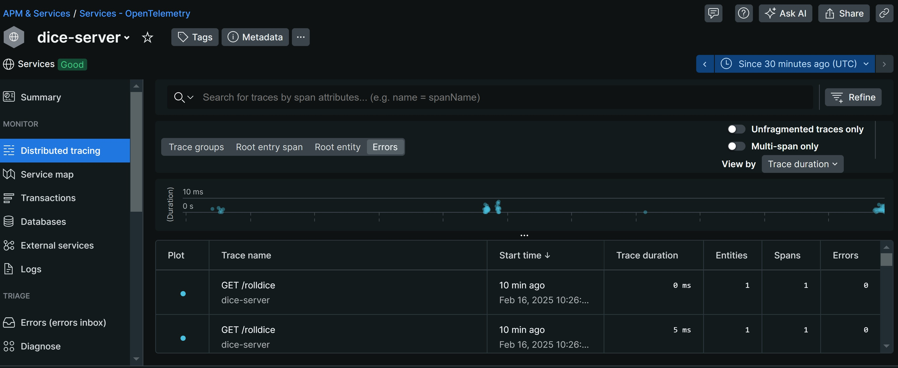
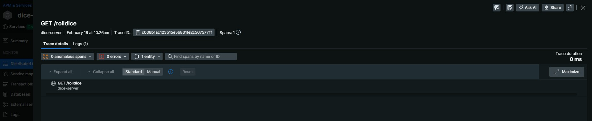
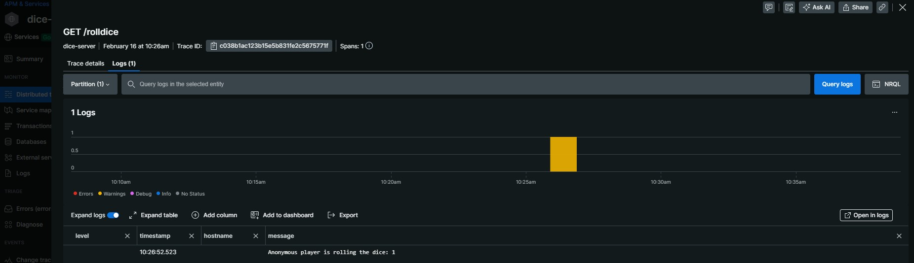
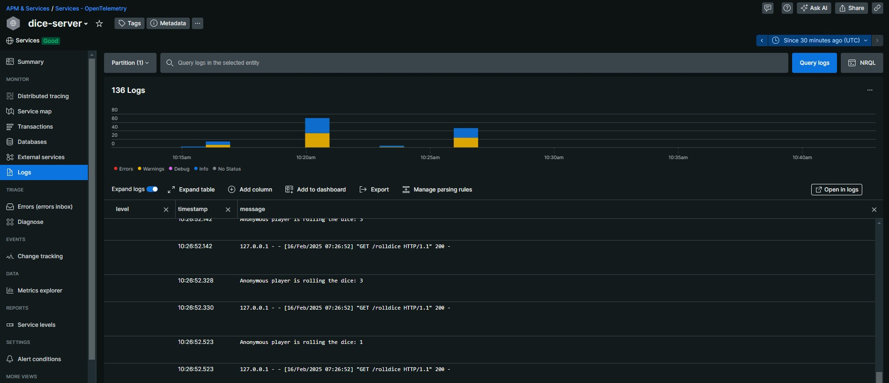

## Example

From Getting Started
https://opentelemetry.io/docs/languages/python/getting-started/ 

Uses Flask


### Windows Execution
```

CREATE VENV
python3 -m venv venv

ACTIVATE VENV
PS C:\Users\rober\Downloads\testes\python-otel> .\.venv\Scripts\activate

INSTALL FLASK 
pip install flask

ZERO CODE INSTRUMENTATION 

INSTALL OTEL DISTRO - contains the OpenTelemetry API, SDK and also the tools
pip install opentelemetry-distro

INSTALL OTEL BOOTSTRAP - This will install Flask instrumentation
opentelemetry-bootstrap -a install

CHECK VARS
(.venv) PS C:\Users\rober\Downloads\testes\python-otel> Get-ChildItem Env:OTEL*

EXPORT VARS
$env:OTEL_EXPORTER_OTLP_ENDPOINT="https://otlp.nr-data.net:4317"
$env:OTEL_EXPORTER_OTLP_HEADERS="api-key=YOUR_KEY"
$env:OTEL_SERVICE_NAME="dice-server"
$env:OTEL_TRACES_EXPORTER="otlp"
$env:OTEL_METRICS_EXPORTER="otlp"
$env:OTEL_LOGS_EXPORTER="otlp"
$env:OTEL_PYTHON_LOGGING_AUTO_INSTRUMENTATION_ENABLED="true"
$env:OTEL_PYTHON_LOG_CORRELATION="true"
$env:OTEL_PYTHON_LOG_LEVEL="DEBUG"

opentelemetry-instrument --traces_exporter otlp --metrics_exporter otlp --logs_exporter otlp --service_name dice-server flask run -p 8080

```

### Results
#### Trace and Logs correlated




#### Logs
